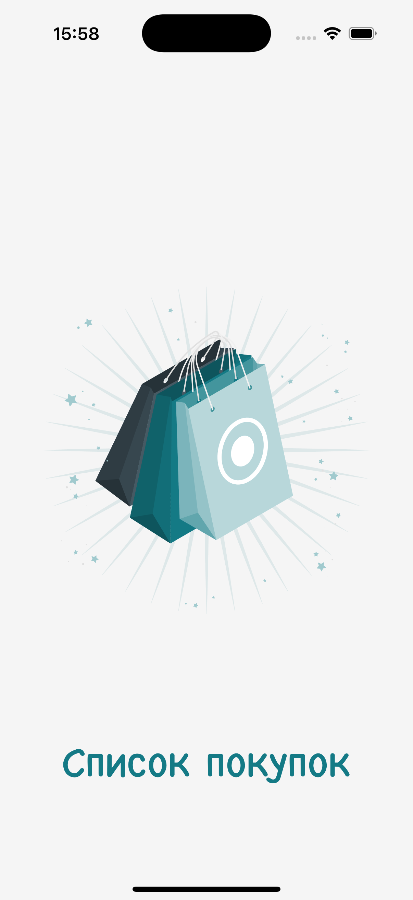
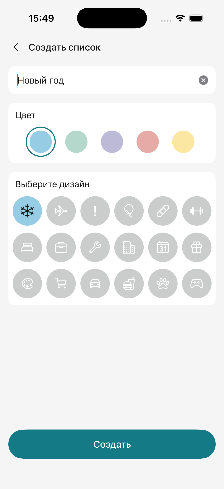
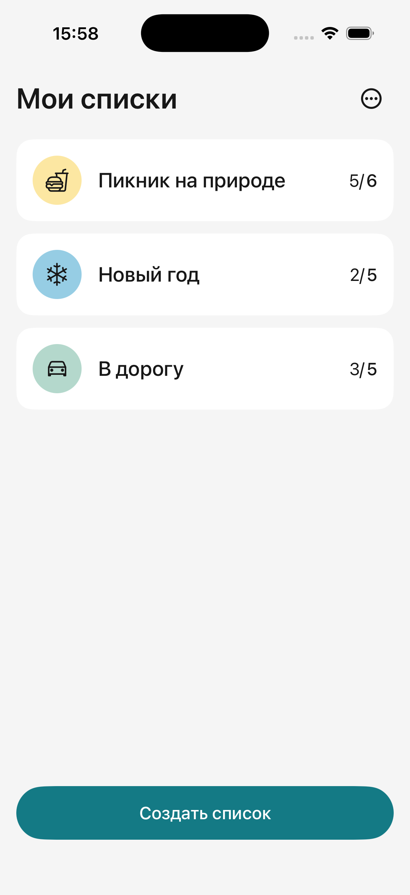
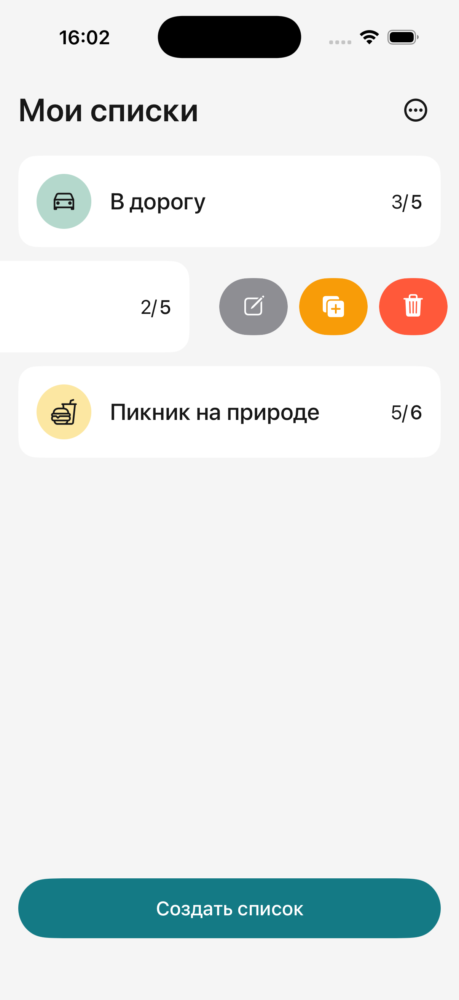
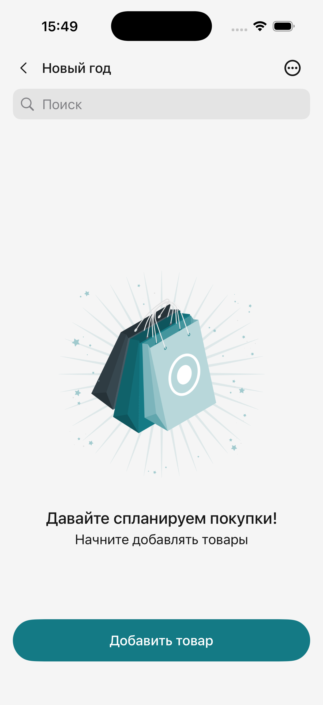
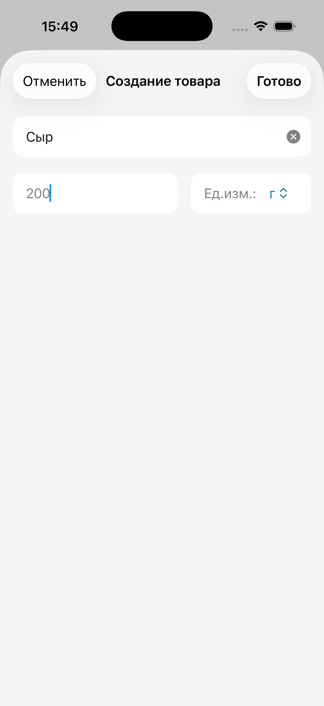
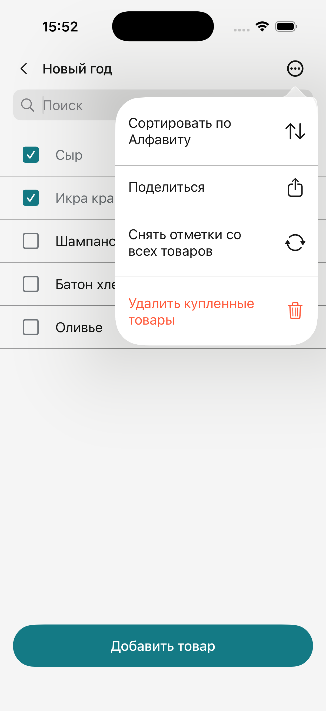
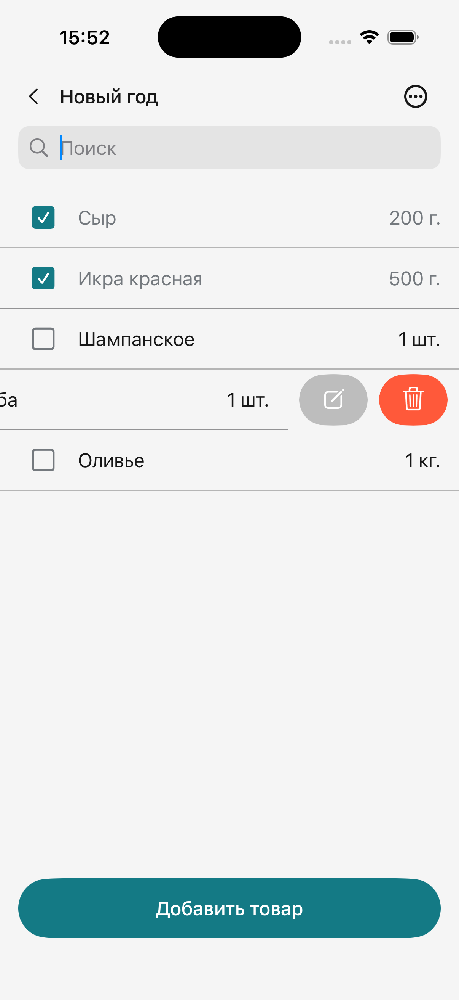

# Shopping List

iOS-приложение для создания списков покупок и управления товарами. Пользователь может создавать тематические списки, добавлять товары с количеством и единицами измерения, отмечать покупки выполненными и делиться списком.

Данные сохраняются локально и доступны между запусками приложения. Проект разработан командой из шести iOS-разработчиков.

## Демо

> Видео работы приложения будет добавлено позже.

## Основной функционал

- Отображение приветственного экрана при первом запуске.
- Создание нескольких списков покупок.
- Выбор названия, цвета и категории списка.
- Редактирование, дублирование и удаление списков.
- Отображение количества купленных и общего количества товаров.
- Сортировка списков по алфавиту в прямом и обратном порядке.
- Добавление и редактирование товаров.
- Указание количества и единицы измерения: штуки, килограммы, граммы, литры или миллилитры.
- Проверка названия товара и защита от добавления дубликатов.
- Отметка товаров как купленных или некупленных.
- Поиск и сортировка товаров по алфавиту.
- Удаление отдельных товаров с подтверждением.
- Сброс отметок со всех товаров.
- Массовое удаление купленных товаров с подтверждением.
- Экспорт списка через системное меню «Поделиться».
- Поддержка светлой, темной и системной тем.
- Сохранение выбранной темы между запусками.
- Отображение пустых состояний для списков и товаров.
- Централизованная push- и modal-навигация.
- Локальное хранение списков и товаров.

## Требования и технологии

- iOS 17.0+
- Swift 6.0
- SwiftUI
- IVO на базе MVVM (`View` + вложенный `@Observable`-объект состояния)
- Observation (`@Observable`)
- SwiftData (`@Model`, `@Query`, `ModelContext`)
- NavigationStack
- UserDefaults
- SwiftLint
- Git Flow

## Мой вклад

В проекте я отвечала за экран товаров, централизованную навигацию и архитектурный рефакторинг:

- перенесла в проект цвета, изображения, иконки и текстовые стили из дизайн-макетов;
- разработала экран списка товаров, ячейку товара и состояния «куплено» / «не куплено»;
- реализовала чекбокс и изменение внешнего вида товара в зависимости от его состояния;
- добавила форматирование количества и отображение единицы измерения;
- реализовала пустое состояние, сброс отметок и удаление купленных товаров;
- вынесла кастомную навигационную панель в переиспользуемый UI-компонент;
- создала централизованный `NavigationRouter` для push- и modal-навигации;
- объединила переходы через типизированные push- и modal-маршруты;
- подключила сценарии создания и редактирования списков и товаров к общему роутеру;
- отрефакторила `AppNavigationView`, `ListView`, `ShoppingItemsView`, `ShoppingItemFormView` и `ListCreationView`, вынеся состояние и пользовательскую логику в `@Observable`-объекты;
- разделила навигацию и UI через замыкания, снизив связанность экранов с роутером;
- провела финальную проверку функциональности приложения.

## Скриншоты

| Экран запуска | Приветственный экран | Пустой список |
|:-------------:|:--------------------:|:-------------:|
|  |  |  |

| Создание списка | Мои списки | Действия со списком |
|:---------------:|:-----------:|:-------------------:|
|  |  |  |

| Пустой список товаров | Создание товара |
|:---------------------:|:---------------:|
|  |  |

| Управление товарами | Действия с товаром |
|:-------------------:|:------------------:|
|  |  |

## Установка и запуск

1. Клонировать репозиторий:

```bash
git clone https://github.com/av-black/ShoppingList.git
```

2. Перейти в папку проекта:

```bash
cd ShoppingList
```

3. Открыть проект:

```bash
open ShoppingList34.xcodeproj
```

4. Выбрать симулятор или подключенное устройство с iOS 17.0+.

5. Собрать и запустить приложение.

Дополнительная установка зависимостей не требуется.

## Команда проекта

- **[Алла Можарова](https://github.com/av-black)** — экран товаров, навигация и архитектурный рефакторинг
- Антон Силенин — iOS-разработчик
- Дмитрий Перчемиди — iOS-разработчик
- Михаил Смирнов — iOS-разработчик
- Степан Качусов — iOS-разработчик
- Максим Кожухов — iOS-разработчик
